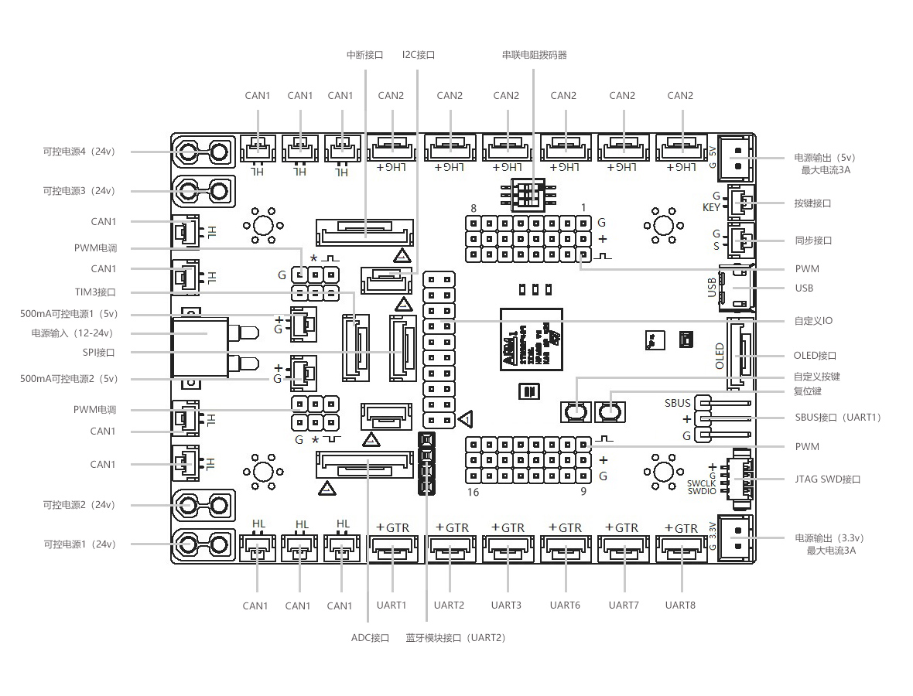
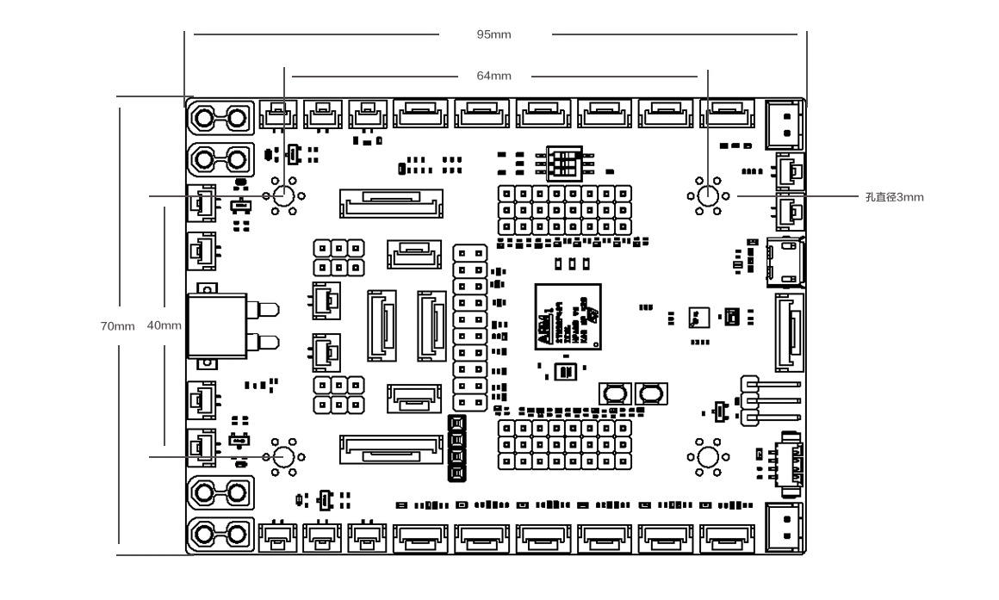

# 🤖 Robot Core Board

⚡ Robot main control development board for robotchain. ⚡

[](https://opensource.org/licenses/MIT)

> 一款全能主控开发板，主控芯片为STM32F427IIH6，拥有非常的功能接口，如IO、USB、LED、ADC、CAN、PWM、IMU、UART等，一块开发板即可覆盖大部分的机器人应用场景。
> 
> An all-in-one main control development board featuring the STM32F427IIH6 microcontroller chip. It boasts a wide array of functional interfaces, including IO, USB, LED, ADC, CAN, PWM, IMU, UART, and more. With this single development board, it can cater to the majority of robot application scenarios.

## 📖 Initialization

> 使用、编译、构建前请在Ubuntu设备中完成robotchain的安装和部署。
>
> Please complete the installation and deployment of `robotchain` on your `Ubuntu` device before using, compiling, and building.

```shell
sudo curl -s https://cdn.geekros.com/robotchain/install.sh|bash
```

## 📖 Install

```shell
sudo apt install -y robot-core-board
```

## 📖 Development Board Information

> 开发板接口标识图
>
> feature parameters

| 参数             | 说明                |
|----------------|-------------------|
| 芯片             | STM32F427IIH6     |
| 芯片处理器          | ARM® Cortex®-M4   |
| 芯片FLASH        | 2MB               |
| 芯片RAM          | 256KB             |
| 最大电压           | 26V               |
| 支持电池           | 3～6S LiPo         |
| 允许最大输入电流\*（持续） | 20A               |
| 尺寸             | 95mm \* 70mm      |
| 工作温度范围         | \-40°C ~ 85°C（TA） |

> 通过板载拨码开关可进行16组PWM接口的输出电压控制
>
> Voltage control of 16 sets of PWM interfaces can be achieved through onboard DIP switches.

| 1   | 2   | 3   | 低侧等效电阻      | 输出电压     |
|-----|-----|-----|-------------|----------|
| OFF | OFF | OFF | 7.68        | 4.9875   |
| ON  | OFF | OFF | 5.741702267 | 6.401126 |
| OFF | ON  | OFF | 4.868636797 | 7.405545 |
| OFF | OFF | NO  | 4.226697892 | 8.408777 |
| ON  | ON  | ON  | 2.81        | 12.24    |
| ON  | ON  | OFF | 4.01        | 8.819    |
| OFF | NO  | NO  | 3.207       | 10.85    |
| ON  | OFF | ON  | 3.565       | 9.82     |

> 开发板接口标识图
>
> Development Board Interface Identification Diagram



> 开发板尺寸图
>
> Development board dimension diagram



> 接口型号对照表
>
> Interface Model Comparison Table

| 接口名称         | 接口数量 | 接口类型       |
|--------------|------|------------|
| 24v可控电源      | 4    | XT30       |
| CAN1         | 10   | GH1.25 2P  |
| CAN2         | 6    | GH1.25 4P  |
| PWM          | 16   | 排针2.45 3P  |
| SBUS         | 1    | 排针2.45 3P  |
| JTAG SWD     | 1    | MX1.25 4P  |
| PWM电调        | 4    | 排针2.54 3P  |
| UART         | 6    | GH1.25 4P  |
| 蓝牙           | 1    | 排针2.54 4P  |
| I2C          | 2    | GH1.25 4P  |
| SPI          | 1    | GH1.25 6P  |
| OLED         | 1    | GH1.25 7P  |
| KEY          | 1    | GH1.25 2P  |
| ADC          | 1    | GH1.25 10P |
| 中断           | 1    | GH1.25 10P |
| TIM3         | 1    | GH1.25 6P  |
| 同步           | 1    | GH1.25 2P  |
| IO           | 18   | 排针2.54 1P  |
| 5v 500mA可控电源 | 2    | GH1.25 2P  |
| 5v 3A电源      | 1    | XH2.54 2P  |
| 3.3v 3A电源    | 1    | XH2.54 2P  |
| USB          | 1    | Micro 5P   |
| 串联电阻拨码器      | 1    |

## 🌞 Development Team

> GEEKROS
> https://www.geekros.com